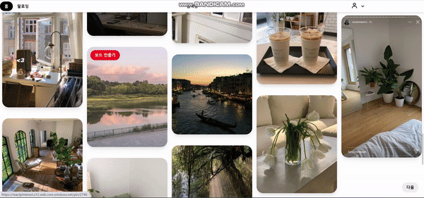
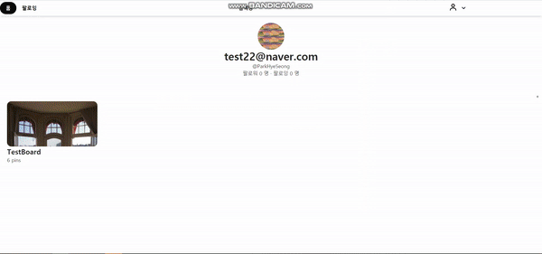
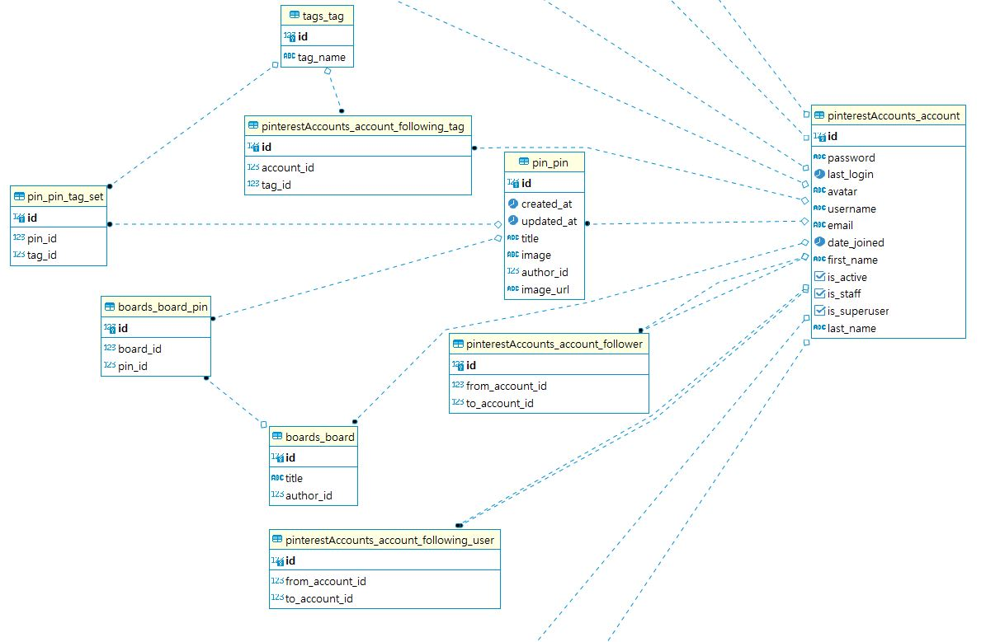

# Django React Pinterest Clone Page

#### Django 와 React 를 이용해 만든 Pinterest Clone Page

### [🔑DemoPage](https://reactpinterest.z12.web.core.windows.net/)

## *Introduction*

### summary
> - Project 소개
>   - Pinterest Clone Page
>   - Content Based Filtering 을 이용한 비슷한 Pin 추천 기능
>   - image 파일뿐만 아니라 URL을 이용한 업로드
>   - Pinterest Pin Crawling 으로 데이터 수집

### Requirements

> - BACKEND
>   - BASE
>      - Python    
>      - Django
>      - djangorestframework
>      - djangorestframework-jwt
>     - Pillow
>     - psycopg2-binary
>     - PyJWT
>     - requests
>     - djangp-rest-auth
>     - pandas
>     - konlpy
>     - sklearn
>     - django-pandas
>   - LOCAL
>     - drf-yasg
>   - PRODUCTION
>        - gunicorn
>       - django-storages[azure]

> - FrontEnd
>   - Axios
>   - Redux
>   - redux-logger
>   - react-masonry-css
>   - TailWind CSS
>   - Antd

> - DataBase
>   - PostgreSQL

> - Deployment
>   - Azure
>   - gunicorn
>   - Docker


### API EndPoints

 #### rest-auth 인증
|PATH|METHOD|AUTH|내용|
|----|----|----|----|
|rest-auth/login|POST|X|JWT 인증 로그인 수행
|rest-auth/logout|POST|O|로그아웃
|rest-auth/registration|POST|X|username, email, password 회원가입
|rest-auth/user|GET|O|현재 유저의 정보 GET
|rest-auth/user|PATCH|O|현재 유저의 username, 프로필사진
|rest-auth/password/change|POST|O|현재 유저의 비밀번호 변경

 #### pinterestAccount
|PATH|METHOD|AUTH|내용|
|----|----|----|----|
|pinterestAccounts/user/{username}|GET|O|username 을 slug 로 받아 해당 유저의 사진, 이름 이메일, 팔로워, 팔로잉을 제공함
|pinterestAccounts/following-user|GET|O|REQUEST USER 의 팔로잉 유저 GET
|pinterestAccounts/following-tag|GET|O|REQUEST USER 의 팔로잉 태그 GET
|pinterestAccounts/follow|POST|O|username 을 받아와 해당 유저 팔로우
|pinterestAccounts/unfollow|POST|O|username 을 받아와 해당 유저 언팔로우

 #### pins
 |PATH|METHOD|AUTH|내용|
 |----|----|----|----|
 |pins/|GET/POST|O| 핀 리스트 GET
 |pins/|POST|O| 핀 생성 (URL or Local Image 가능), 핀이 생성될 때 제목에 '#'이 붙은 단어는 tag 에 자동으로 추가됨(signal).
 |pins/following_pin|GET|O|현재 유저가 팔로우하는 태그/유저 의 핀 리스트 GET
 |pins/{id}|GET|O|Pin 의 id 를 pk 로 받아와 해당 핀의 정보 GET
 |pins/{id}|DELETE|O|해당 핀의 author 가 현재 유저일 경우 핀 DELETE
 |pins/{id}/sim_pin_list|GET|O| pin.id=id 에 해당하는 핀 추천 리스트 GET
 
  #### tags
 |PATH|METHOD|AUTH|내용|
 |----|----|----|----|
 |tags/{id}/follow_tag|POST|O| 해당 태그 Follow
 |tags/{id}/unfollow_tag|POST|O| 해당 태그 Unfollow
 
   #### boards
 |PATH|METHOD|AUTH|내용|
 |----|----|----|----|
 |boards/|GET/POST|O| 현재 유저의 보드 리스트 GET
 |boards/{id}/add_pin|POST|O|request.data['id'] 로 받아온 핀을 {id} 보드에 핀을 추가함
 
 
 ### Front Components

 ##### 인증 관련
|File Name|End Point|Directory|Description|
|----|----|----|----|
|login.js|/|pages/account/|로그인 Form, 로그인 성공시 메인 화면으로 이동|
|signup.js|/|pages/account/|회원가입 Form, 회원가입 성공시 로그인 화면으로 이동|
|LoginRequiredRouter.js|||인증되지 않은 사용자는 메인(로그인) 화면으로 이동|


 ### Pin Recommend Algorithm

 <kbd>
    
 </kbd>


 > - Content Based Recommender System
 >   - Pin 의 Title 을 분석하여 Pin 들 간의 유사도 구현
 ```
 #utils2.py
 def gs(metadata):
    from konlpy.tag import Okt
    okt = Okt()
    title_lists = metadata["title"].fillna('')
    title_lists = [' '.join(re.findall(r"([a-zA-Z\dㄱ-힣]+)", title)) for title in title_lists]
    noun_title_lists = [' '.join(okt.nouns(title)) for title in title_lists]

    tfidf = TfidfVectorizer(min_df=1)

    tfidf_matrix = tfidf.fit_transform(noun_title_lists)
    # similarities = tfidf_matrix * tfidf_matrix.T
    similarities = linear_kernel(tfidf_matrix, tfidf_matrix)
    return similarities
 ```
 
 ### Crawler
 > - Pinterest Crawler With Selenium
 >   - Selenium 과 ChromeDriver 을 통한 Pinterest 의 이미지 크롤링
 >   - Pin Tag 는 Pinterest 내부 알고리즘으로 핀 이미지에 맞는 Tag 를 제시해줌
 >   - Pinterest 사이트 로그인 -> Pin URL 추출
 >   - 각각의 URL 을 돌면서 Pin Tag/Image URL 추출
 >   - 해당 내용 POST (author='crawler')
 ```
 utils.py
 def post_pin_from_pin_set(driver, pin_set):
    for pin_id in pin_set:
        try:
            pin_id = int(pin_id)
        except ValueError:  # 가끔 int 가 아닌 값이 들어옴 이 경우 걸러내기
            continue
            
        url = 'https://www.pinterest.co.kr/pin/{}'.format(pin_id)
        driver.get(url)
        element = WebDriverWait(driver, 10).until(
            EC.presence_of_element_located((By.CSS_SELECTOR, '.PinBetterSave__DownArrowContainer.PinBetterSave__'
                                                             'DownArrowContainer--lego')))  # 10초 기다릴 때까지 js 로딩 확인
        try:
            image = driver.find_element_by_css_selector(".MIw.QLY.Rym.ojN.p6V.sLG.zI7.iyn.Hsu")
            link = image.find_element_by_xpath('./div/img').get_attribute('src')

            driver.find_element_by_css_selector(".PinBetterSave__DownArrowContainer.PinBetterSave__DownArrowContainer--lego"
                                                ).click()
            time.sleep(1)
            tag_set = driver.find_elements_by_css_selector(".tBJ.dyH.iFc.yTZ.pBj.DrD.IZT.mWe.z-6")
            title = ''.join(["#"+tag.text+" " for tag in tag_set[1:4]])
            print(title)
            Pin(author_id=2, title=title, image_url=link).save()
        except NoSuchElementException:  # 이미지가 아니라 gif 일 경우는 그냥 넘어감
            pass
 ```

### Upload Image Using URL

 <kbd>
    
 </kbd>

> - url 로 이미지 업로드
>    - image url 을 ByteIO 로 읽어서 메모리에 저장
>    - 저장한 데이터를 File 객체로 바꿔서 save
```
#pin.models.py
class Pin(models.Model)
    #...
    def save(self, *args, **kwargs):
        if self.image_url:
            data = utils.retrieve_image(self.image_url)
            self.image.save("gPtjddl.jpg", File(data), save=False) # Media Storage 에 Image 저장. prefix:gPtjddl123, save=True 로 하면 무한루프에 걸림 
        super().save(*args, **kwargs)
```

### Extract Tag And Post

> - 정규표현식과 Django signal 을 이용한 태그 추출 및 포스트
```
#pin.models.py
class Pin(models.Model):
#...
    def get_tags_from_title(self):
        tag_name_list = re.findall(r"#([a-zA-Z\dㄱ-힣]+)", self.title)
        tag_list = []
        for tag_name in tag_name_list:
            tag, _ = Tag.objects.get_or_create(tag_name=tag_name)  # 객체와 bool 이 리턴되므로 뒤에껀 버림
            tag_list.append(tag)
        return tag_list

#pin.signals.py
@receiver(post_save, sender=Pin)
def insert_tags(sender, instance, created, **kwargs):
    if created:
        for name in Pin.get_tags_from_title(instance):
            instance.tag_set.add(name)
```

### DB Models


#### DB 최적화 작업 (04.30~)

1. pin.views

before (159 queries)
-> after (5 queries)
```
    queryset = Pin.objects.select_related('author')\
    .prefetch_related('tag_set')\
    .prefetch_related('boards')\
    .all()
```

Recommender 에서 Pin title 과 id 를 빈번하게 사용하고, 시간이 오래걸리기 떄문에 Index 추가해줬음

최대 13초 -> 11초
최소 4초 -> 2.6초

```
# Pin.models
#...
    class Meta:
        indexes = [
            models.Index(
                name="Pin_title_idx",
                fields=["title","id"]
            )
        ]
```

## issue

> - No 'Access-Control-Allow-Origin' header is present on the requested resource. 

> - azure.common.AzureHttpError: Server failed to authenticate the request. Make sure the value of Authorization header is formed correctly including the signature. ErrorCode: AuthenticationFailed

> - 로그인을 한 뒤 다른 곳에서 request.user 를 호출하면 anonymoususer 가 나옴;;

> - 미디어 파일을 로컬이에서 선택해서가 아니라 url([https://i.pinimg.com/236x/76/d0/ce/76d0ced78f2bf72370d753afaead0d63.jpg](https://i.pinimg.com/236x/76/d0/ce/76d0ced78f2bf72370d753afaead0d63.jpg)) 을 통해 업로드하는 방법 
>   - InMemoryUploadedFile 로 시도 → 로컬에선 되지만 cloudinary 로 업로드할 때 'Empty File' 에러 
>   - ContentFile 로 시도 →  url 이미지가 cloudinary 에 업로드 되는데, 무한으로 업로드됨

> - 많은 쿼리를 이용해 최적화를 경험하고 싶음 → 더 많은 용량이 필요함. 
>   - cloudinary 는 이용하기 쉽지만 transaction 도 카운트되어 적절하지 않다고 생각.(비쌈) azure storage 로 변경하기로 함

> - 핀의 title 에서 tag 를 추출해서 Tag Model 에 저장하려고함. 근데 추출까진 했는데 Tag Model 에 저장하기 전에 save 과정이 끝나버림
>   - django Signal 의 post_save() 를 사용하여 Pin save() 이후에 Tag save() 하도록 했음

> - infinite scroll 은 구현했지만 스크롤을 해서 쌓이는 데이터가 많아질 수록 로딩이 길어짐 → 현재 보고있는 데이터만 저장하고 이전 데이터는 쓰지 않도록 해야 함
>   - [https://medium.com/naver-fe-platform/무한-dom-렌더링-최적화-경험기-237e6e9088e8](https://medium.com/naver-fe-platform/%EB%AC%B4%ED%95%9C-dom-%EB%A0%8C%EB%8D%94%EB%A7%81-%EC%B5%9C%EC%A0%81%ED%99%94-%EA%B2%BD%ED%97%98%EA%B8%B0-237e6e9088e8)
>   - [https://coffeeandcakeandnewjeong.tistory.com/52](https://coffeeandcakeandnewjeong.tistory.com/52)

> - 무한스크롤 관련 에러가 계속 나오는데 react-virtualize 를 완전히 이해하고 써야 할 것 같음
>   - [https://ko.reactjs.org/docs/optimizing-performance.html#virtualize-long-lists](https://ko.reactjs.org/docs/optimizing-performance.html#virtualize-long-lists)
>   - 오류를 못고치겠음 → 차선책으로 무한스크롤 없이 만들자.

> - Pin Recommend Algorithm 이 배포 환경에서 오래걸려서 계속 Time Out 이 나옴 -> gunicorn 의 timeout 설정 "--timeout", "120"

> - csv 파일로 읽고 쓰기를 하면 유지보수의 어려움이 예상됨 -> django-pandas 패키지 설치 후, 추천 알고리즘을 실행할 때 쿼리로 처리하도록 함

